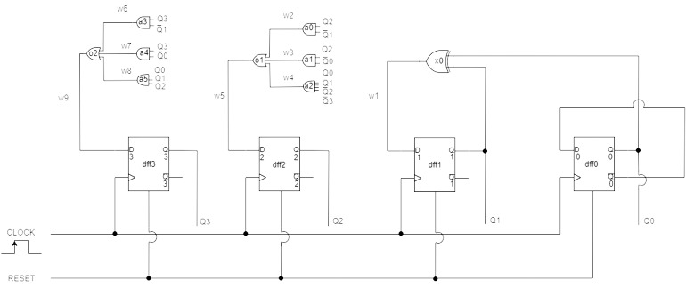
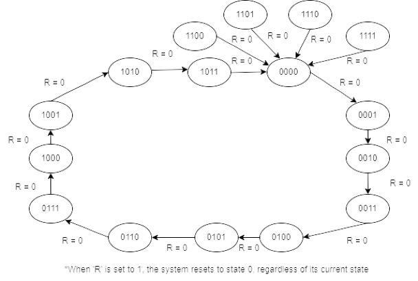
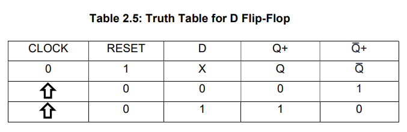
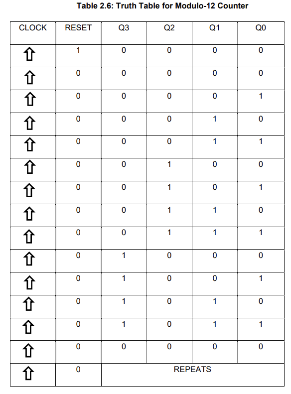
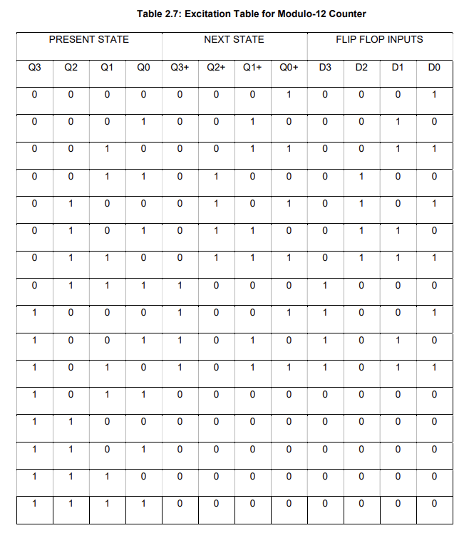
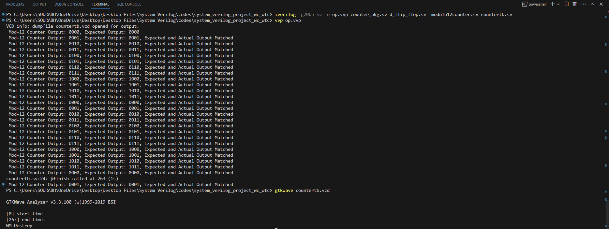
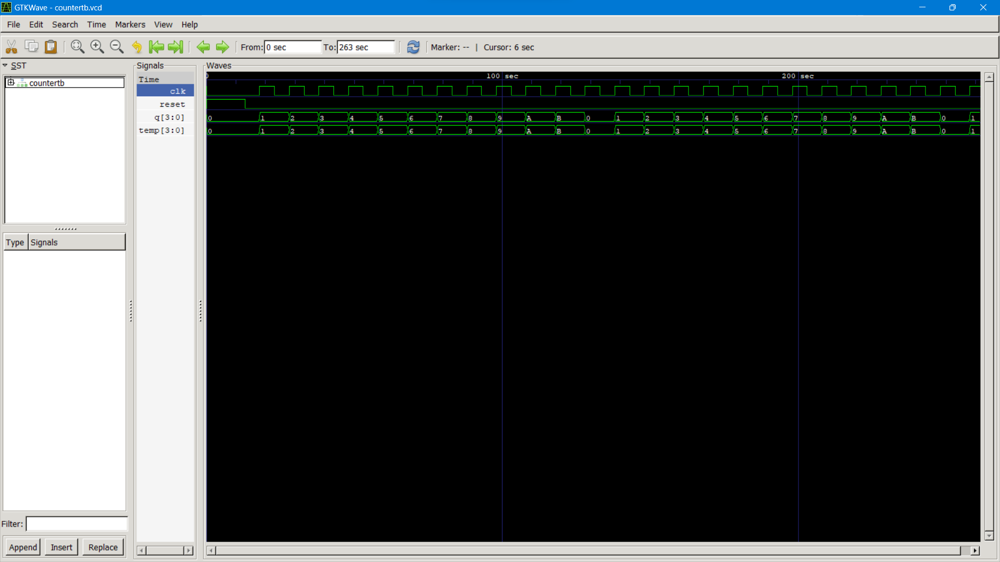

# Synchronous Modulo 12 Counter using D Flip Flops

## Problem Statement
Write structural Verilog code for a synchronous modulo-12 counter using
D flip-flops. Implement an OOP-based test bench to test the counter’s
functionality. Treat the DUT as a black box and compare the output
against the expected results. Inputs: Clock, Reset. Expected Output:
0000, 0001, 0010, 0011, ..., 1010, 1011.

## About
The synchronous modulo-12 counter is a vital digital circuit widely used in various  applications including frequency dividers, frequency synthesizers and event  sequencers. Its purpose is to count in a cyclical pattern from 0000 to 1011.

## Abstract
This project presents a synchronous modulo-12 counter design using D flip-flops in System Verilog. An object-oriented test bench is used to verify the counter’s functionality, comparing its output against the expected sequence (0000 to 1011). The test bench employs synchronous clock and asynchronous reset signals to simulate the counter’s behavior, ensuring accurate modulo-12 counting. This implementation can be applied to various digital systems requiring modulo counting such as frequency dividers and timing generators.
## Circuit Diagram / State Diagram



## Tech Stack

**Programming Language Used:** System Verilog

**Software Used:** Vivado ML 2023.1, Icarus Verilog, VS Code, GTKWave. 

**Hardware Used:** Spartan 3


## Brief Explaination on Working of Mod12Counter
The synchronous modulo-12 counter is a digital circuit that counts through a 
predefined sequence of states in a cyclic manner, following the modulo-12 
sequence (0000 to 1011). It is designed using D flip-flops to achieve synchronous 
operation, ensuring precise state transitions with each clock pulse. The counter 
module has two main inputs: the clock signal (CLOCK) and the reset signal 
(RESET). 

**i. Initialization:**
At power-up or when the reset signal (RESET) is asserted, the counter is 
initialized to its initial state (0000). The reset signal ensures that the counter 
starts counting from the first state. 

**ii. State Transitions:**
When the reset signal is deasserted and the clock signal (CLOCK) starts 
oscillating, the counter begins its operation. With each rising edge of the clock 
signal, the counter’s state transitions.The counter counts in a binary sequence 
from 0000 to 1011 and wraps back to 0000, following the modulo-12 behavior. 
As the clock pulses, the counter increments through the binary states.

**iii. Synchronous Operation:**
The use of D flip-flops ensures synchronous operation. On each rising edge 
of the clock signal, the data input (D) of each D flip-flop is updated with the 
value of its previous flip-flop’s output (q[n-1]), where ‘n’ is the current bit 
position of the counter. This synchronous behavior ensures that all flip-flops 
change their states simultaneously, avoiding any glitches or hazards that 
might occur in an asynchronous counter. 

**iv. Output:**
The counter’s output is represented by the four-bit binary values (q[3:0]). 
These outputs correspond to the current state of the counter and provide the 
binary representation of the modulo-12 count. The counter cycles through the 
states 0000, 0001, 0010, 0011, ..., 1010, 1011, and then wraps back to 0000, 
forming a continuous cyclic counting sequence. 

**v. Verification:**
To ensure the correctness of the counter’s behavior, an OOP-based test 
bench is utilized. The test bench generates input stimuli, including clock pulses 
and reset signals, to simulate various scenarios and exercise different counter 
states. During simulation, the test bench monitors the counter’s outputs and 
compares them against the expected output sequence (0000 to 1011). Any 
inconsistencies between the simulated output and the expected output are 
logged and analyzed to verify the counter’s functionality. 
## Truth Table




## Breif Explaination of Code

**i. d_flip_flop.sv:** 
 The ‘d_flip_flop’ module implements a D flip-flop using a behavioral approach. 
It takes a data input ‘d’, a clock signal ‘clk’, and a reset signal ‘reset’. On the 
rising edge of the clock, the D flip-flop stores the input value ‘d’ in its output ‘q’. 
The complementary output ‘qb’ is the inverse of ‘q’. If the reset signal is 
asserted, ‘q’ is set to 0 and ‘qb’ is set to 1. Otherwise, ‘q’ takes the value of the 
input ‘d’ and ‘qb’ takes the value which is complement to ‘q’. 

**ii. modulo12counter.sv:**
 The ‘modulo12counter’ module implements a synchronous modulo-12 counter 
using D flip-flops in a structural approach. It has a 4-bit output ‘q’ representing 
the counter’s current count in binary form. The counter counts from 0 to 11 
(0000 to 1011) and then rolls over back to 0 (0000) to repeat the pattern. The 
counter uses four D flip-flops (‘d_flip_flop’) to store the binary count. It also 
employs combinational logic gates (‘and’, ‘or’, ‘xor’) to generate the next states 
of the counter. 

**iii. modulo12counter_tb.sv:** 
 The ‘modulo12counter_tb’ module implements a test bench for the modulo-12 
counter. The ‘clk’ and ‘reset’ signals are declared as ‘reg’, and the counter 
output ‘q’ is declared as ‘wire’. The test bench generates the clock signal with 
a 50% duty cycle. Initially, the reset signal is asserted to reset the counter. After 
a short delay, the reset signal is deasserted and the counter starts counting. 
The test bench simulates the counter for 30 clock cycles and then terminates 
the simulation. It displays the counter output (‘q’) at every positive edge of the 
clock. 

**iv. counter_pkg.sv:** 
 The ‘counter_pkg’ package defines the ‘Mod12Counter’ class, describing the 
counter’s behavior using OOP concepts. It has member variables ‘q’, ‘clk’ and 
‘reset’ with the constructor initializing them. The class includes two functions: 
‘update’ to implement modulo-12 logic, incrementing the counter unless reset 
is asserted and resetting it to 0 when reaching 11 and ‘getOutput’ to read the 
current counter value (‘q’). 

**v. countertb.sv:** 
 The ‘countertb’ module is an OOP-based test bench for the modulo-12 counter. 
It imports ‘counter_pkg’, instantiates ‘modulo12counter’ (‘dut’) with ‘clk’, ‘reset’ 
and ‘q’ signals. ‘mod12counter_expected’ tracks the expected output. The test 
bench initializes ‘clk’ with 50% duty, asserts ‘reset’ initially, then deasserts it 
after a short delay. The 'verify' task compares 'q' with expected output from the 
‘Mod12Counter’ class. The results are displayed at each positive clock edge to 
ensure the counter's correctness.

## Running Tests

Run this command in terminal window of VS Code / Windows Terminal to compile the files:

```system verilog
iverilog -g2005-sv -o op.vvp d_flip_flop.sv modulo12counter.sv counter_pkg.sv countertb.sv
```
After successful compilation run this command to get the output:

```vvp op.vvp```

Run this command to observe waveforms in GTKWave software:

```gtkwave countertb.vcd```


## Obtained Outputs

Output in Terminal Window of VS Code using Icarus Software:



Output Waveform using GTKWave:



Implementation of Code on FPGA Device:

https://github.com/sourabhshenoy04/synch_mod12_counter/assets/105969078/76936256-a43f-465f-a372-45e3ebdd6081

Code Used: mod12counter_on_FPGA.v file

## Result and Discussion
The Verilog code for synchronous modulo-12 counter using D flip-flops was 
successfully implemented and tested, counting accurately from 0000 to 1011 without 
glitches. While software simulation verified its correctness, real-world testing is 
essential. During testing, various errors were encountered, including logical errors, 
LSB and MSB mismatches and reversed outputs. Interestingly, the Icarus Verilog 
simulator initially produced different result compared to expected output, while Vivado 
software provided the expected result. Adding a display function after reset in line 17 
of countertb.sv file resolved the issue, providing a perfect output as shown . The output waveform generated during testing was used to verify the expected 
and required output and the comparison is represented . The expected 
output and the actual output matched perfectly as per the truth table.
## Conclusion
The synchronous modulo-12 counter using D flip-flops was successfully implemented, 
accurately counting from 0000 to 1011. While software testing provided positive 
results, real-world testing is necessary for practical applications. Synchronous 
counters are crucial for accurate counting in complex systems. They find practical uses 
in digital communication, industrial control, time measurement, signal processing, 
embedded systems, and test equipment. Real-world testing is vital for practical 
application validation. For future development, exploring hardware implementation 
can further validate its practical usefulness. 
## References used

[1] Website: Design a mod-12 synchronous up counter, Computer Engineering.
ExpertsMind.https://www.expertsmind.com/questions/design-a-mod-12-
synchronous-up-counter-30160762.aspx. Referred on 23-07-2023. 

[2] Website: SystemVerilog Tutorials. SystemVerilog Functions. Chip Verify. 
https://www.chipverify.com/systemverilog/systemverilog-tutorial. Referred on 
25-07-2023. 

[3] Website: Manishkj116. Counter Design using verilog HDL. 
GeeksForGeeks.https://www.geeksforgeeks.org/counter-design-using-verilog-hdl/. Referred on 25-07-2023. 

[4] YouTube Video: Techno Tutorials (e-Learning). October 6, 2021. MOD 12 
Synchronous Up Counter Using D Flip Flop | MOD 12 Counter | Digital 
electronics. https://youtu.be/ZBIl31r4lYM. Referred on 23-07-2023. 

[5] YouTube Video: ElectroTech CC. October 19, 2020. 4-bit Mod-12 Synchronous 
Counter using D flip-flop || Sequential Logic Circuit | Digital Electronics. 
https://youtu.be/0jxvgMORUCE. Referred on 27-07-2023
